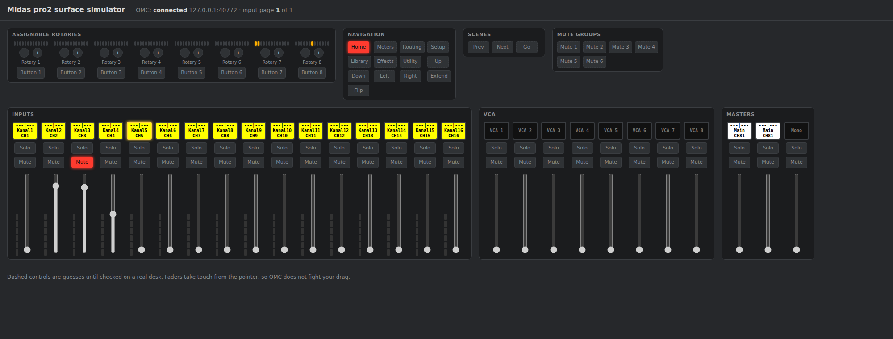

# prosurface: Midas PRO1/PRO2 as an OMC control surface

`prosurfaced` runs on a Midas PRO1, PRO2 or PRO2C (or on any Linux box, with
the built-in simulator) and presents the PRO's faders, buttons, rotaries,
LEDs and LCD select buttons to OMC as an **X32 Full surface** over TCP. OMC
keeps using its existing X32 surface driver, so every binding, bank and page
in OMC works unchanged.



```
PRO surface hardware ─┐                                 OMC host (X32, M32 or PC)
                      ├─ driver ─ mapping ─ X32 emulator ── TCP ── socat pty ── omc --surface-tty
browser simulator ────┘          prosurfaced
```

Status: the protocol, mapping, bridge and simulator work end to end against
OMC. The driver for the real desk (`internal/driver/scanproc`) is a stub
until the PRO scan processor protocol is captured from a desk (see
[Desk checklist](#desk-checklist)).

## Try it with the simulator

Needs Go 1.24+, `socat`, and an OMC PC build (`./compile.sh TARGET_PC_SDL2`).

```sh
cd prosurface
go run ./cmd/prosurfaced -model pro2          # simulator on http://localhost:8080
# second terminal: bridge TCP to a pty and start OMC as an X32 Full on it
socat pty,raw,echo=0,link=/tmp/ttyPRO tcp:127.0.0.1:10000 &
../build/pc_sdl2/omc -b --model X32 --surface-tty /tmp/ttyPRO
```

Open the simulator, press a select button or turn a rotary, and watch OMC
light the LEDs, colour the LCD buttons and move the motor faders. Use
`-model pro1` or `-model pro2c` for the 8-strip desks, where EXTEND flips the
input strips between X32 board L and board M.

## OMC changes

| Option | What it does |
| --- | --- |
| `--model X32` | Overrides the detected model. Bodyless/PC mode otherwise always runs as a WING Compact. |
| `--surface-tty PATH` | Opens the X32 surface on `PATH`, even in bodyless mode. |

Both are in the `Debug Surface` group of `omc --help`.

## Layout

| Package | Role |
| --- | --- |
| `internal/x32proto` | X32 surface wire protocol: frame decoder (with byte stuffing), event encoder, typed parsers for `L` `F` `D` `M` `R` frames. `testdata/` holds a real OMC capture. |
| `internal/x32full` | X32 Full element table, generated from `src/x32config.cpp` (`go generate ./...`). |
| `internal/pro` | PRO1 / PRO2 / PRO2C control lists. Controls marked provisional are guesses until checked on a desk. |
| `internal/mapping` | PRO control to X32 element rules; `-dump-mapping` prints the default as JSON, `-mapping file.json` loads an edited one. |
| `internal/bridge` | State and translation in both directions, EXTEND paging, fader touch handling. |
| `internal/driver` | Driver interface; `sim` (in-memory) and `scanproc` (real desk, not yet implemented). |
| `internal/simui` | Go templates + htmx 4.0.0 (vendored, BSD-0-Clause) simulator, updates over SSE. |

## Default mapping

| PRO | X32 Full in OMC |
| --- | --- |
| Input strips 1–8 | Board L strips 1–8 |
| Input strips 9–16 (PRO2) / EXTEND page 2 (PRO1, PRO2C) | Board M strips 1–8 |
| VCA strips 1–8 | Board R strips 1–8 |
| Left and Right masters | Main fader strip (both follow each other) |
| Mono master | not mapped |
| Rotaries 1–6 and buttons | Display encoders 1–6 and buttons |
| Rotaries 7, 8 | Gain, Pan/Bal |
| Home, Meters, Routing, Setup, Library, Effects, Utility, arrows | Same X32 buttons |
| Flip | Sends on fader |
| Scene prev/next/go, mute groups 1–6 | Same X32 buttons |

## Desk checklist

Everything past the simulator needs a real PRO. Do the backup first.

1. Photograph the computer board, the scan processor board and the DSP board, with part numbers legible.
2. Note the boot disk type and image it with `dd` from a live USB. Keep the original disk aside.
3. Check the BIOS for USB boot and passwords.
4. Boot a live Linux USB and save `lspci -nnvv`, `lsusb -v`, `dmesg`, `ip link` and `ls -l /dev`.
5. Find how the scan processor connects to the computer (USB, serial, Ethernet, ribbon).
6. Capture traffic while using the stock software: `usbmon` + Wireshark for USB, a logic analyser or USB-serial tap for serial, `tcpdump` for Ethernet. Press one button, move one fader, turn one rotary, and note the time of each.
7. Capture again while the stock software changes LEDs, motor faders and LCD colours (recall two different scenes).
8. Put the stock disk back and check the desk still boots.

With those captures, `internal/driver/scanproc` gets implemented against the
`driver.Driver` interface; nothing else in the daemon changes.
